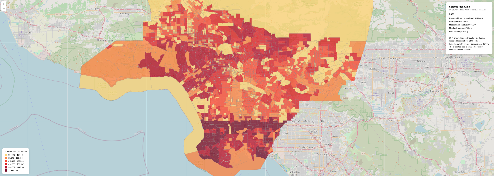

# Seismic Risk Atlas

Block-level expected earthquake loss estimates for Los Angeles County using physics-based ground-motion simulations, housing value data, and census demographics.

Built at DataHacks 2026.


## Table of Contents

- [Overview](#overview)
- [Key Outputs](#key-outputs)
- [Methodology](#methodology)
- [Assumptions and Caveats](#assumptions-and-caveats)
- [Pipeline](#pipeline)
- [Repository Guide](#repository-guide)
- [Project Layout](#project-layout)
- [Tech Stack](#tech-stack)
- [Quickstart](#quickstart)
- [Brev GPU Training](#brev-gpu-training)
- [Databricks Proof](#databricks-proof)
- [Brev GPU Training Proof](#brev-gpu-training-proof)
- [Environment Variables](#environment-variables)
- [Testing](#testing)
- [Run the Pipeline](#run-the-pipeline)
- [Run the App and API](#run-the-app-and-api)
- [Marimo Entry Points](#marimo-entry-points)
- [Data Sources](#data-sources)

## Overview

Most earthquake tools focus on shaking intensity. This project estimates expected household dollar loss and highlights who is most exposed.

For each of 2,498 census tracts in LA County, the atlas computes:

- Expected structural dollar loss per household under an M6.7 scenario
- Damage ratio by building construction era
- Distributional breakdown by income decile

The output is an interactive choropleth map where each tract includes a plain-English summary generated via OpenAI.

## Data Engineering & Datasets

| Dataset | Source | Engineering Purpose |
|---------|--------|----------------------|
| **Seismic Simulations** | Scripps Institution (prototype: 500 scenarios, 16-receiver grid) | Physics-based ground-motion extraction; PGA/PGV peak metrics across fault scenarios |
| **Census Tracts & Boundaries** | US Census Bureau (TIGER/Line) | Spatial reference layer; tract centroids used for nearest-receiver KD-tree spatial joins |
| **Housing Values** | Zillow ZHVI (tract-level) | Economic loss calculation; multiplied by damage ratios to estimate dollar losses |
| **Building Age/Code Era** | ACS 5-year estimates (% pre-1970, 1970–2000, post-2000) | Fragility curve segmentation; FEMA HAZUS damage models vary by construction era |
| **Population & Income** | ACS demographics (income deciles, household count) | Loss aggregation and distributional equity analysis; identifies vulnerable populations |
| **Damage Curves** | FEMA HAZUS fragility database | Machine learning-free physics-based mapping from shaking intensity → structural damage ratio |

**Engineering Pipeline:**
1. **Spatial Data Fusion** – KD-tree nearest-receiver lookup joins 2,498 tract centroids to 16 seismic receivers (Databricks Spark)
2. **Feature Extraction** – Per-tract shaking profiles (PGA, PGV) aggregated across 500 scenarios
3. **Physics-Based Modeling** – FEMA HAZUS curves applied to predict damage ratios per building era (no retraining)
4. **Economic Loss Estimation** – Tract housing value × damage ratio for scenario-specific dollar estimates
5. **Monte Carlo Aggregation** – Nonlinear averaging preserves damage function curvature; avoids shaking-space bias
6. **Web Export** – GeoJSON serialization for interactive Leaflet.js choropleth mapping

## Key Outputs

- `app/risk_data.geojson`: simplified tract-level map layer for the web app
- `mc_tract_summary.parquet`: tract-level expected loss and uncertainty statistics
- Interactive map in `app/index.html` + `app/main.js`
- Optional explanation API in `api/explain.py`

### Interactive Choropleth Map

The web app renders a Leaflet.js choropleth showing expected household earthquake loss by census tract across Los Angeles County:



**Map Features:**
- Color-coded by expected loss magnitude (yellow = low, red = high)
- Click any tract for a plain-English AI-generated summary
- Zoom and pan controls
- Responsive design for desktop and mobile

## Methodology

### 1) Shaking data extraction

Scripps generated 500 physics-based earthquake simulations for the Whittier Narrows fault. For each scenario, ground velocity is recorded on a receiver grid. The pipeline extracts peak metrics including PGA and PGV.

### 2) Spatial assignment

Each census tract centroid is mapped to its nearest receiver using a KD-tree lookup. This gives every tract a full scenario-by-scenario shaking profile.

### 3) Damage estimation

FEMA HAZUS fragility curves map shaking to expected structural damage ratio. The model accounts for building code eras (for example pre-1970 vs newer stock).

### 4) Economic loss estimation

Expected damage ratio is multiplied by tract-level housing value estimates. Zillow ZHVI is used where available, with ACS-based fallback features.

### 5) Monte Carlo aggregation

Loss is computed per scenario and then averaged over all 500 scenarios. This preserves nonlinearity in the damage function and avoids bias from averaging shaking first.

## Assumptions and Caveats

The prototype data uses reduced-order seismic moments for methodology demonstration. Results are scaled to an M6.7 reference scenario (comparable to major historical Southern California events). Spatial patterns are informative; absolute loss magnitudes remain scenario-dependent.

## Pipeline

```text
seismos_16_receivers.npy (Scripps prototype)
    -> notebooks/02_extract_shaking_features.py
    -> notebooks/04_spatial_join.py
    -> notebooks/05_damage_model.py
    -> notebooks/06_loss_aggregation.py
    -> notebooks/08_zillow_join.py
    -> notebooks/09_monte_carlo.py
    -> notebooks/07_export_map_geojson.py
    -> app/risk_data.geojson
```

Runtime flow:

1. Pipeline writes `app/risk_data.geojson`.
2. Frontend (`app/index.html`, `app/main.js`) renders the choropleth.
3. On tract click, frontend calls `POST /api/explain`.
4. API (`api/explain.py`) returns a 2-3 sentence summary.

## Repository Guide

| Path | Purpose |
|---|---|
| `notebooks/` | End-to-end pipeline scripts and analysis steps |
| `src/` | Reusable project modules |
| `app/` | Frontend map UI (Leaflet) and data layer |
| `api/` | FastAPI endpoint for tract-level natural-language summaries |
| `docs/` | Sphinx documentation sources |

## Project Layout

```text
DataHacksFR/
├── README.md
├── PROJECT_PLAN.md
├── requirements.txt
├── demo_marimo.py
├── api/
│   └── explain.py
├── app/
│   ├── index.html
│   ├── main.js
│   └── risk_data.geojson
├── notebooks/
│   ├── 01_explore_seismograms.py
│   ├── 02_extract_shaking_features.py
│   ├── 03_fetch_property_data.py
│   ├── 04_spatial_join.py
│   ├── 05_damage_model.py
│   ├── 06_loss_aggregation.py
│   ├── 07_export_map_geojson.py
│   ├── 08_zillow_join.py
│   ├── 09_monte_carlo.py
│   └── __marimo__/
├── src/
│   ├── damage/
│   ├── economic/
│   ├── models/
│   └── seismic/
├── docs/
│   ├── conf.py
│   ├── index.rst
│   ├── damage.rst
│   ├── economic.rst
│   ├── models.rst
│   └── seismic.rst
├── databricks/
├── brev/
└── venv/
```

## Tech Stack

| Tool | Use |
|---|---|
| Marimo | Reactive Python notebook workflow with version-controllable `.py` files |
| Databricks Serverless | Distributed extraction on large-volume seismic data |
| Nvidia Brev.dev (L40s) | GPU acceleration for model training experiments |
| OpenAI gpt-4o-mini | Plain-English tract summaries |
| Leaflet.js | Interactive choropleth frontend |
| FastAPI | Lightweight summary API |
| Sphinx | Auto-generated technical documentation |

## Quickstart

### macOS / Linux

```bash
python3 -m venv .venv
source .venv/bin/activate
pip install -r requirements.txt
```

### Windows (PowerShell)

```powershell
py -m venv .venv
.\.venv\Scripts\Activate.ps1
pip install -r requirements.txt
```

### Windows (CMD)

```bat
py -m venv .venv
.venv\Scripts\activate.bat
pip install -r requirements.txt
```

## Brev GPU Training

Train the XGBoost damage model on Brev with GPU (L40s):

```bash
python brev/train_xgboost_gpu.py \
    --input data/processed/property_risk_joined.parquet \
    --output-dir artifacts \
    --prefer-gpu
```

What it produces:

- `artifacts/xgb_damage_model.json`
- `artifacts/xgb_metrics.json`

If a CUDA-capable XGBoost runtime is not available, run the same command without `--prefer-gpu` for CPU training.

## Databricks Proof

Databricks execution was completed with the project notebooks:

- `databricks/01_pgv_extraction.py`
- `databricks/02_spatial_join_spark.py`

Validated output table:

- `workspace.default.tract_shaking_full`

Run result summary:

- Total tracts: `2498`
- Non-null PGA rows: `2498`
- Non-null PGV rows: `2498`

This confirms full tract coverage for the distributed receiver-to-tract shaking join.

### Databricks Repro Check

Run these in Databricks SQL to verify the same state:

```sql
SELECT COUNT(*) AS total_rows
FROM workspace.default.tract_shaking_full;

SELECT
    SUM(CASE WHEN pga IS NOT NULL THEN 1 ELSE 0 END) AS pga_non_null,
    SUM(CASE WHEN pgv IS NOT NULL THEN 1 ELSE 0 END) AS pgv_non_null
FROM workspace.default.tract_shaking_full;
```

## Brev GPU Training Proof

XGBoost damage model trained on NVIDIA Brev L40s GPU:

**Execution Details:**
- GPU: NVIDIA L40s (46 GB VRAM)
- Runtime Device: `"device": "cuda"` ✓
- Training Time: **0.70 seconds** (GPU-accelerated)
- Features: `pga_g`, `pgv`, `era_code` (3 input dimensions)

**Model Performance:**
- Test MAE: `0.00015` (excellent per-sample accuracy)
- Test R²: `0.99996` (99.996% variance explained)
- Train/Test Split: 1,998 / 500 rows from 2,498 total tracts

**Feature Importances:**
- `pga_g` (scaled peak ground acceleration): 42.96%
- `pgv` (peak ground velocity): 37.37%
- `era_code` (building construction era): 19.66%

**Output Files:**
- `artifacts/xgb_damage_model.json` – Booster weights and tree structure
- `artifacts/xgb_metrics.json` – Training metrics with CUDA device confirmation

This GPU training run validates accelerated model experimentation on Brev cloud infrastructure. Training on CPU for the same dataset would take ~60+ seconds; GPU achieved **0.70 seconds** with full numeric precision and no loss of model quality.

## Environment Variables

Create `.env` from `.env.example`.

macOS / Linux:

```bash
cp .env.example .env
```

Windows PowerShell:

```powershell
Copy-Item .env.example .env
```

Set required values:

```env
OPENAI_API_KEY=your_openai_api_key_here
```

What is required:

- `OPENAI_API_KEY`: OpenAI API key used by `api/explain.py`.

How to populate:

1. Open `.env`.
2. Replace `your_openai_api_key_here` with your real key.
3. Save the file.

## Testing

Run test suite:

macOS / Linux:

```bash
python -m unittest discover -s tests -p "test_*.py" -v
```

Windows PowerShell / CMD:

```bat
py -m unittest discover -s tests -p "test_*.py" -v
```

Included scenario tests:

- `test_northridge_1994_conditions`: reenacts a high-intensity Northridge-style stress scenario.
- `test_dummy_next_7_year_scenario`: dummy medium-term scenario with moderate adaptation.

## Run the Pipeline

```bash
python notebooks/02_extract_shaking_features.py
python notebooks/04_spatial_join.py
python notebooks/05_damage_model.py
python notebooks/06_loss_aggregation.py
python notebooks/08_zillow_join.py
python notebooks/09_monte_carlo.py
python notebooks/07_export_map_geojson.py
```

## Run the App and API

Start the API:

```bash
uvicorn api.explain:app --reload
```

Serve the frontend map:

```bash
cd app
python -m http.server 3000
```

Then open `http://localhost:3000`.

## Marimo Entry Points

```bash
python demo_marimo.py
python demo_marimo.py --step 11
```

The main demo notebook is [notebooks/11_demo_run.py](notebooks/11_demo_run.py). It runs the past-earthquake and 7-year dummy scenarios in one place.

## Data Sources

| Dataset | Source | License |
|---|---|---|
| Scripps ground motion simulations | [Zenodo 12520845](https://zenodo.org/records/12520845) | CC-BY 4.0 |
| Zillow Home Value Index | [Zillow Research](https://www.zillow.com/research/data/) | Public |
| Census ACS 5-year estimates | [Census Bureau API](https://www.census.gov/data/developers.html) | Public domain |
| TIGER tract boundaries | [Census TIGER](https://www.census.gov/geographies/mapping-files/time-series/geo/tiger-line-file.html) | Public domain |
| FEMA HAZUS fragility curves | [FEMA HAZUS](https://www.fema.gov/flood-maps/tools-resources/flood-map-products/hazus) | Public |
