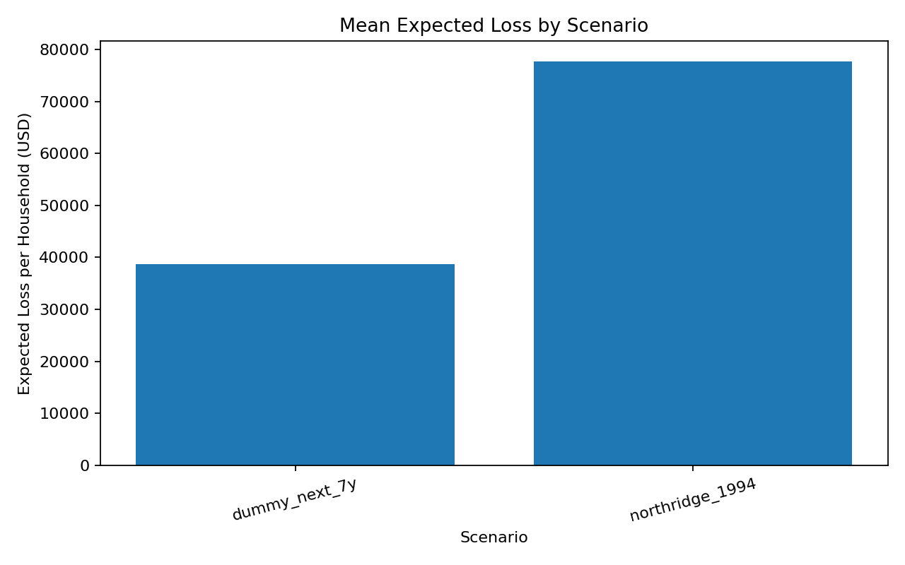
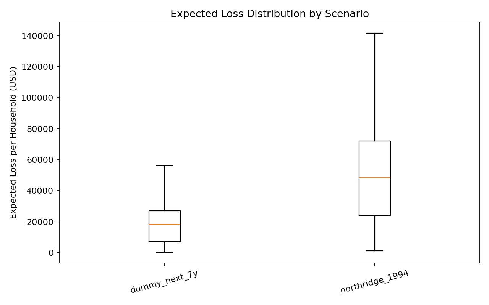
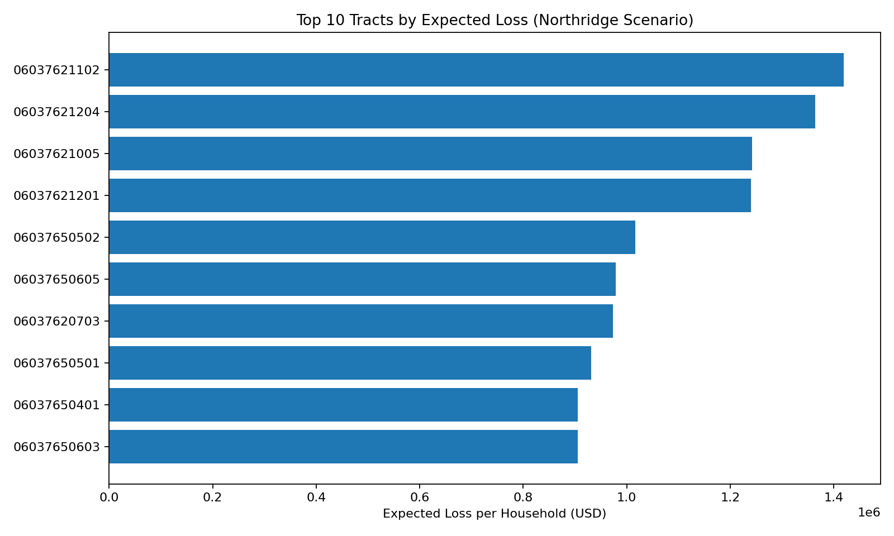
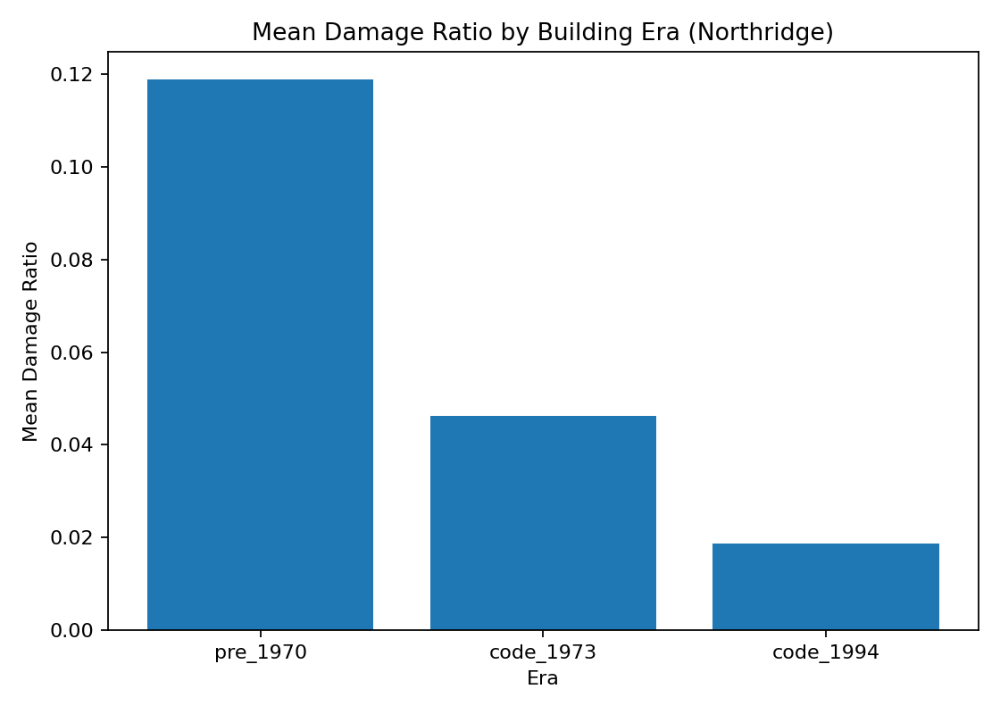

# Submission Results

## Scenario Test Results

| scenario | n_tracts | mean_expected_loss | median_expected_loss | p95_expected_loss | max_expected_loss | mean_damage_ratio | max_pga_g |
|---|---|---|---|---|---|---|---|
| dummy_next_7y | 2498 | 38676.70511180133 | 18154.670211460838 | 131374.77278657237 | 1102371.8945529936 | 0.04679001953520613 | 0.48 |
| northridge_1994 | 2498 | 77717.67682878471 | 48501.95391386187 | 261286.72246291925 | 1419445.4307872436 | 0.09466224604895516 | 0.65 |

## Visuals

### Mean Expected Loss by Scenario


### Expected Loss Distribution by Scenario


### Top 10 Tracts by Expected Loss (Northridge)


### Mean Damage Ratio by Building Era (Northridge)


## Model Training Smoke Metrics

- MAE: 0.00015
- R2: 0.99996
- Training seconds: 0.70
- Runtime: {'tree_method': 'hist', 'device': 'cuda'}

## Test Command

```bash
source venv/bin/activate
python -m unittest discover -s tests -p "test_*.py" -v
```